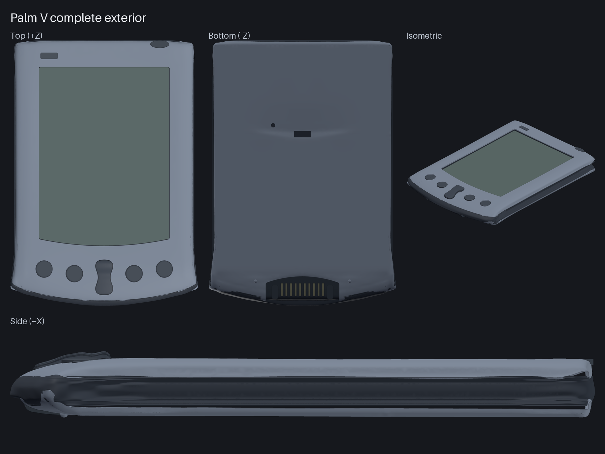
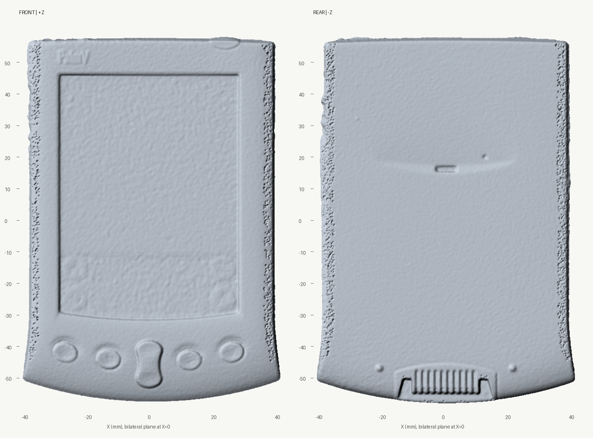
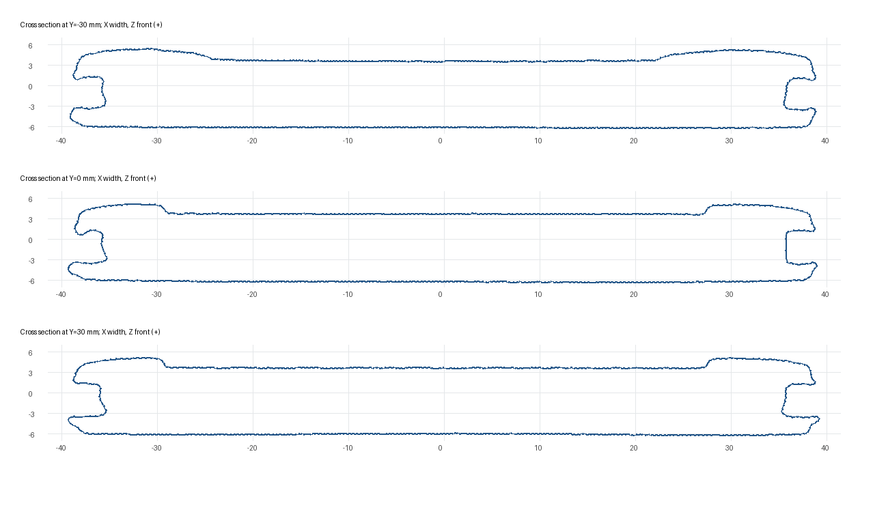
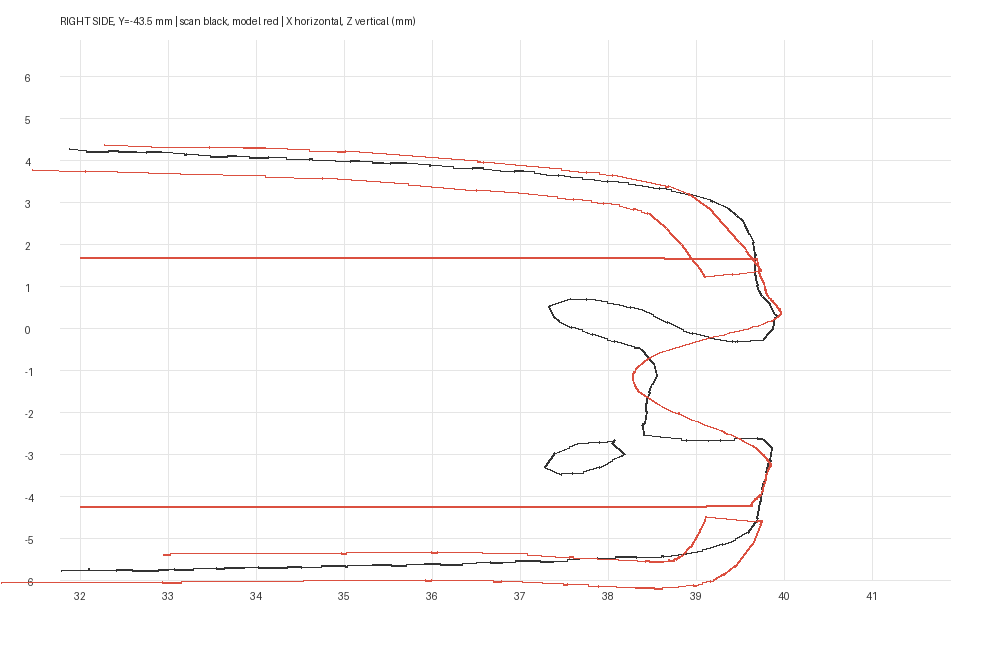

# Complete Palm V reconstruction audit

This is the frozen review of the 30 September 2026 complete exterior reconstruction. The [complete assembly source](../../parts/palm_v_complete.py), its partial predecessor, and preserved scans are committed in the project; generated STEP, STL, GLB and live reports remain ignored under `build/`. Paths shown as code are relative to the Palm V project root unless stated otherwise. The [contact sheet](sheet.png), [validation snapshot](validation.json), [comparison snapshot](comparison.json) and selected diagnostic evidence below preserve the reviewed state.

Final artifact audit, 30 September 2026. The model reconstructs the assembled PDA exterior as 30 editable components. Its principal forms are smooth and bilaterally constrained, while power, contrast and rear control details retain their intentional positions. Hidden seats and supports are exterior-model surrogates; the scan does not establish their manufactured internal construction.

**Deviations above the 0.5 mm comparison tolerance remain.** This is a faithful visual reconstruction with documented local approximations, not an all-surface metrology match or a certified manufacturing replica. The final sampled maxima are 2.884 mm from exposed CAD to scan and 1.111 mm from scan to nearest CAD. A rare control-area seam exposes the largest CAD outlier; the bulk of both surfaces is substantially closer.

## Source and datum

The supplied `aesub-blue Palm V.stl` is the complete assembled PDA, with 473,168 triangles and 236,588 indexed vertices. It is watertight and consists of one meaningful connected object plus an insignificant four-triangle speck. The preserved `scans/palm-v-rough-observed.ply.gz` retains its original triangle coordinates and source provenance. No part-specific scale adjustment was applied. Millimetres are the established project interpretation; STL itself does not declare units.

The frozen production transform is `references/palm-new-reference-frames.json`, entry `whole`. X=0 is the bilateral plane; positive Y points toward the top, positive Z toward the display. The observed extents in this frame are approximately 81.553 by 115.881 by 13.137 mm. An independent robust reflection fit agrees with these extents within about 0.02 mm. Its diagnostic axes differ in Y/Z sign, so `alignment.json` in the evidence folder is a cross-check, not a replacement production datum.

A robust plane fit to the central observed display gives `z = -0.00083745*x + 0.00043452*y + 3.609294`, with median absolute residual 0.045 mm and p95 0.142 mm. Keeping the nominal glass plane at Z=3.593 mm is supported by this evidence. The four keys follow the measured curved row, the scroll crown follows the measured longitudinal profile, and the ten dock contact lanes follow the rear roll rather than a flat box.

## What was corrected

The long side channels use straight nominal runs with smooth end transitions. Their deep recesses are preserved: the central channel wall is around |X|=35.6 mm, while the rolled metal lips reach about |X|=38.5 to 39.2 mm. The front and rear skins remain independently fitted surfaces. The rocker was changed from a straight tilted ramp to a curved profile; display and key seats close the most conspicuous views into the hollow surrogate frame. The rear dock now has ten recessed contact lanes, deeper paired latch pockets and a closure behind its upper edge.

Every exported component is a valid BRep solid. The final STEP reopens as 30 solids; the final STL reopens watertight with consistent winding. Components remain separate in the assembly, including intentional contacts or overlaps, so watertight serialization does not certify collision-free manufactured interfaces or a single fused printing solid. The final refined export required zero triangle removals and no hole filling. An earlier superseded export dropped two float32-collapsed zero-area triangles; that cleanup does not apply to the delivered artifact.

## Comparison method and scope

The final run reads the preserved original PLY through `read_palm_reference.py`, applies only the frozen rigid transform, and uses `nurb.compare` for exact unsigned nearest-triangle distances. The model is the delivered GLB with requested absolute linear tessellation deflection 0.025 mm, angular deflection 0.08 radians for the frame and 0.18 for the other components. The deflection is a mesher request, not a measured universal error bound. Native surface normals are included in the GLB.

The fixed seeds draw 7,000 area-uniform CAD samples and 3,500 scan samples. Exact triangle-ray tests in 26 directions retained 2,715 exposed CAD samples; genuinely occluded assembly faces were excluded. Directions are finite, so a surface visible only through a narrower opening may be omitted. Nearest CAD matches for 369 scan samples were buried or not exposure-confirmed; those samples are explicitly flagged, not silently certified as matching the exterior. Of the 3,131 source samples whose nearest CAD match was exposure-confirmed, 98.37% were within 0.5 mm, with p95 0.313 mm and sampled maximum 1.111 mm.

Region masks are geometric and overlap. They include exposed seats and recess walls at those coordinates, not only the nominal top face of the named component. In particular, the display and rocker regional CAD statistics include their visible border and seat surfaces. Sampled coverage estimates and maxima are not continuous bounds. A change in tessellation changes the fixed-seed area sample locations; the last refinement revealed a previously unsampled control seam without changing the native geometry.

### Exposed CAD to original scan

| Region | Samples | Median mm | p95 mm | Sampled max mm | Within 0.5 mm |
|---|---:|---:|---:|---:|---:|
| Whole measured surface | 2715 | 0.099 | 0.520 | 2.884 | 94.70% |
| Front skin region | 584 | 0.061 | 0.334 | 2.884 | 98.63% |
| Display and border region | 589 | 0.061 | 0.885 | 1.188 | 91.68% |
| Four application keys | 41 | 0.182 | 0.466 | 0.751 | 95.12% |
| Scroll rocker and seat | 25 | 0.085 | 1.190 | 1.500 | 84.00% |
| Broad rear skin | 829 | 0.171 | 0.395 | 0.824 | 99.64% |
| Side channels | 263 | 0.131 | 0.445 | 0.813 | 96.58% |
| Rear dock and latch region | 106 | 0.244 | 1.405 | 1.507 | 63.21% |
| Upper controls | 81 | 0.074 | 0.400 | 2.884 | 97.53% |

### Original scan to nearest complete CAD surface

The final column records source samples whose closest CAD triangle was not exposure-confirmed. Corresponding confirmed-only regional results are preserved in the comparison JSON.

| Region | Samples | Median mm | p95 mm | Sampled max mm | Within 0.5 mm | Unconfirmed nearest exposure |
|---|---:|---:|---:|---:|---:|---:|
| Whole measured surface | 3500 | 0.087 | 0.316 | 1.111 | 98.40% | 369 |
| Front skin region | 770 | 0.052 | 0.268 | 0.646 | 99.35% | 31 |
| Display and border region | 728 | 0.056 | 0.153 | 0.765 | 98.76% | 1 |
| Four application keys | 35 | 0.073 | 0.341 | 0.446 | 100.00% | 18 |
| Scroll rocker and seat | 36 | 0.056 | 0.339 | 0.526 | 97.22% | 2 |
| Broad rear skin | 1132 | 0.168 | 0.313 | 1.027 | 99.65% | 220 |
| Side channels | 371 | 0.135 | 0.472 | 1.090 | 95.96% | 12 |
| Rear dock and latch region | 106 | 0.073 | 0.301 | 1.111 | 97.17% | 26 |
| Upper controls | 82 | 0.074 | 0.519 | 0.646 | 92.68% | 2 |

## Symmetry and smoothness evidence

The front half is explicitly mirrored before joining, frame sections are explicitly mirrored, and paired keys, contact lanes and rear locating features share symmetric definitions. Intended asymmetric control and rear marked regions are excluded from the exterior reflection statistic. Among 2,487 reflected exposed samples, median deviation is 0.000000 mm, p95 0.001323 mm and the sampled maximum 0.016524 mm. All were within the 0.05 mm symmetry check band.

Earlier relative tessellation produced apparent asymmetry up to 0.518 mm. Exact native BRep checks at the three worst frame sample pairs and one front pair found original/reflected distances equal to approximately 1e-14 mm; the exported sample points themselves lay as much as 0.351 mm from the native frame and 0.212 mm from the native front. That diagnosed a display-mesh problem. The final absolute tessellation and native normals address it; those earlier diagnostic values are retained in `native-symmetry-check.json` with their scope. Smooth spline surfaces and tangent transitions do not by themselves certify global G2 continuity, which was not claimed or tested here.

Residual soft side shading can still appear in some rendered views. During the display investigation, a fixed-height probe showed approximately six degrees of apparent normal variation from triangle-normal interpolation. That display result did not establish corresponding native surface waviness. The final frame uses the finer 0.08-radian angular tessellation and native normals, but the rendered highlights are not a continuity certificate.

## Desktop and preview pass

This is a regular nurb assembly, discovered and selected through the existing `list_parts` and `nurb:part` paths. No React shell or engine feature files were changed for this model delivery. The project-specific precision preview runner serves the supplied absolute-tessellated meshes and native normals. It does not change the ordinary desktop mesher, so opening the project through another standard viewer session may use different display tessellation. The delivered STEP, GLB and numerical audit remain bound to the artifact hashes below.

## Remaining local approximations and openings

- **Upper control seam:** the largest exposed-CAD sample is `(30.589, 53.825, 1.650)` on a frame ledge, 2.884 mm from the scan. It has an unobstructed diagonal ray `(-1,+1,+1)` through the control region. This is a remaining local view into a simplified support/seam, not a broad shell offset. It is retained in the report rather than removed from the statistics.
- **Rear dock and latch edges:** simplified pocket walls, ledges and backing interfaces account for CAD deviations up to 1.507 mm. A scan sample near `(11.711,-50.281,-4.511)` is 1.111 mm from the model. The ten lane pitch and longitudinal rear roll are supported by the scan, but the detailed latch transition surfaces remain approximate.
- **Side-channel mouths:** around `Y=-43.5`, small folded returns and retaining protrusions are not fully reproduced by the smooth frame loft. A source sample near `(-37.889,-43.497,-2.787)` differs by about 1.090 mm. Its mirror matches the scan within 0.049 mm, so this is a real symmetric local detail, not scan asymmetry. The channel-mouth section image shows the omitted small returns while the long recessed channels remain present.
- **Display and scroll seats:** the measured glass plane and corrected scroll crown fit closely, but visible border walls and support undersides remain surrogate geometry. The display/border region reaches about 1.188 mm CAD-to-scan difference. The scroll region includes underside/seat samples about 1.500 mm from the observed outer crown; source-to-scroll p95 and maximum are reported in the regional tables. Thin marked graphics and legends were not reproduced as measured physical engraving.
- **Small rear marks and controls:** details around `Y=16` to `20` include residuals near 1.027 mm. Fine slots, recess edges, surface markings, exact control clearances and unknown internal assemblies remain approximate. Power and contrast locations are intentionally asymmetric rather than mechanically mirrored.
- **Closure scope:** all 20 originally observed display-to-interior ray paths are blocked in the final assembly. Ten of the 16 later diagnostic paths are also blocked; six still admit a ray, principally at local rocker/dock/underside openings. These are recorded in `closure-rays.json`. The model should not be described as a continuously sealed external envelope merely because its individual component meshes are watertight.

The measured lower flare check at `(±40.43,-45.83,-4.25)` is 0.472 mm on the left and 0.362 mm on the right from the scan. At `(±36.08,-49.48,-4.25)` the corresponding distances are 0.102 and 0.026 mm. These local checks support keeping the smooth flare rather than changing it solely because a spline extends beyond its landmark polygon.

## Reference classification

The original Palm Computing *Palm V Handbook*, copyright 1998-1999, P/N 405-1139-01, was consulted through [the archived manufacturer PDF](https://palmdb.net/content/files/archive-docs/palm-v-handbook/49646723-Handbook-Palm-V.pdf), printed pages 6 and 9, only to distinguish power/contrast controls, stylus/cover tracks and the infrared feature. No dimensions or fitted surfaces were taken from handbook illustrations. Material colors are illustrative assignments, not scan texture data.

## Identity and reproducibility

Original supplied STL SHA256: `1dcc44e532f4416eb654e1b8b46c7a9345e2a6d822f9e1acb3345afdcb120a2b`.

Preserved original PLY gzip SHA256: `f53be50195cc6595f9661c1c70c0f1f83331f287a46f8d85a414a8d951849fae`.

| Delivered artifact | SHA256 |
|---|---|
| palm_v_complete.step | `35d9bf5f8865c8dff742bd7d8d4fc1f05ee45aab3674caa02fa7f7a9d89fbe50` |
| palm_v_complete.glb | `f3d35c359dbc35862721e02f440216a2a0428a23542d2fd2bade2826b52ca4be` |
| palm_v_complete.stl | `162b5842a3f167abb81e00b884d87a1ba6989643dd75c54056f8f398b094b309` |

The full audited source hash inventory is retained in [validation.json](validation.json); the numerical snapshot also records its validator and C++ visibility-source hashes. [manifest.json](manifest.json) hashes every file included in this frozen review and identifies the audited generated artifacts without committing those large binaries. The full per-sample NPZ and dense section arrays are not included; rerunning the validator recreates its comparison JSON and NPZ in `build/`. Reference diagnostics use the saved datum; earlier native-versus-relative-mesh checks remain explicitly historical evidence.

The publication copy of `references/export_complete.py` adds only output-directory creation for a fresh clone. This portability change does not alter geometry. The validation snapshot preserves the original audited exporter hash; the manifest records both its original and publication hashes. No artifact IDs or measured results were rewritten to imply that the edited utility generated the frozen files. Reproduction requires the same relevant software behavior, and exact generated-file hashes are not promised across toolchain versions.

Run the following from the project with a Python environment containing nurb, NumPy, SciPy and trimesh, plus a C++17 compiler. The helper compiles into the system temporary directory and no fixed home-directory path is required.

```bash
python references/export_complete.py
python references/validate_complete.py --self-test
python references/validate_complete.py --samples 3500 --tolerance 0.5
```

The default model is `build/palm_v_complete.glb`; relative model/output arguments resolve from the project directory. The default comparison reference is the preserved original PLY and frozen whole-object datum. The validator rejects an artifact that changes during the run. Its meaningful nested-box self-test retained all 150 exterior points and rejected all 150 fully buried points.

## Diagnostic images








